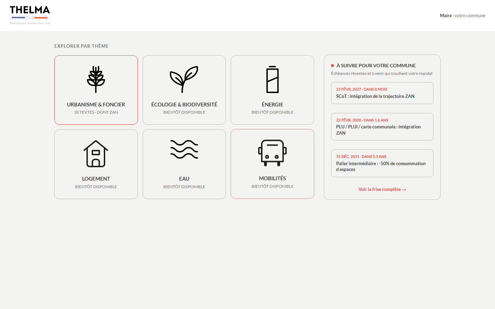

### Nom du défi
Thelma — Retrouver la généalogie d'une intention législative (le cas du ZAN)

### Description courte
Thelma est une plateforme pour les élus qui traduit les lois en enjeux locaux et bénéfices concrets.
Elle permet aux élus de monter rapidement en compétence de manière ludique.
Elle donne les éléments nécessaires pour s'approprier la loi et la communiquer.
Elle permet aux élus décliner l'intention du législateur en actions concrètes pendant son mandat.

### Porteur
Nicolas Thouvenin

### Description longue

Le ZAN est un cas d'école pour la « généalogie d'une intention législative » :
une intention unique et datée (réduire l'artificialisation des sols, posée par
la loi Climat et Résilience du 22 août 2021) qui se retrouve précisée,
corrigée et contestée par plusieurs lois, décrets et
propositions en cours, jusqu'à aujourd'hui.

Plutôt qu'un graphe destiné à un public d'analystes, nous avons choisi de
mettre cette généalogie au service d'un public précis — les élus locaux, en
priorité les maires — avec deux volets :

1. **Le squelette généalogique** — une base structurée (lois, décrets, textes
   infra-réglementaires, propositions en cours) avec pour chaque texte : date,
   catégorie (fondatrice / préparatoire / sectorielle pour une loi ; noyau /
   connexe pour un décret) et ses relations explicites avec les autres textes
   (modifie / complète / remplace / précise / abroge).
2. **La mise en usage** — cette base alimente un tableau de bord pensé pour un
   élu local : ce qui le concerne dans son mandat (frise et vue
   Gantt des échéances, avec ce qui reste incertain faute d'un vote définitif
   sur la proposition de loi TRACE), et comment l'expliquer à
   ses administrés (fiches « argumentaire » : pourquoi le texte existe,
   objections fréquentes et réponses, marges de manœuvre concrètes).

Le pipeline d'automatisation (extraction PDF → synthèse LLM → structuration en
fiches généalogiques) est fonctionnel : un script segmente un texte de loi ou
de décret, un modèle de langage (Groq, llama-3.3-70b-versatile) en extrait une
fiche structurée avec la consigne stricte de ne jamais inventer une relation
non mentionnée explicitement dans le texte. La base de données actuellement
chargée dans l'application est une transcription initiale d'un corpus de
référence transmis par le porteur du défi ; la bascule vers une génération
100 % automatisée est le script près (voir
[docs/methodologie.md](docs/methodologie.md) pour le détail de ce qui est déjà
automatisé et ce qui reste volontairement à valider par un humain — les
échéances de mandat et les argumentaires ne sont jamais publiés sans relecture).

Un second pipeline, indépendant, ingère et classe par force juridique
(contraignant vs. interprétatif) des sources juridiques connexes au ZAN
(codes, jurisprudence, droit européen), avec une confiance explicite du LLM
sur les cas ambigus plutôt qu'un classement à l'aveugle.

### Image principale

### Contributeurs
- Nicolas Thouvenin (porteur)
- Philippe Cases
- Thelma Tertrais
- Amine Abouhodaifa
- Jérome Funamal
- Carlos Holguin
- Guillaume de la Lubie
- Adewoye Shakir Oyeossi
- Alex Sant André

### Ressources utilisées
Cochez les ressources utilisées en remplaçant `[ ]` par `[x]`.

- [ ] `openfisca-france-parameters` — Base de données de paramètres ✺ OpenFisca
- [x] `an-dossiers-legislatifs` — Dossiers législatifs de l'Assemblée nationale (législature courante) ✺ Assemblée nationale
- [x] `an-amendements-xvii` — Amendements déposés à l'Assemblée nationale (législature actuelle) ✺ Assemblée nationale
- [ ] `an-comptes-rendus` — Comptes rendus de la séance publique à l'Assemblée nationale (législature actuelle) ✺ Assemblée nationale
- [ ] `an-votes-xvii` — Votes des députés (législature actuelle) ✺ Assemblée nationale
- [ ] `an-deputes-en-exercice` — Députés en exercice ✺ Assemblée nationale
- [ ] `an-deputes-historique` — Historique des députés ✺ Assemblée nationale
- [ ] `an-deputes-senateurs-ministres-par-legislature` — Députés, sénateurs et ministres d'une législature ✺ Assemblée nationale
- [ ] `an-agenda-reunions` — Agenda des réunions à l'Assemblée nationale (législature courante) ✺ Assemblée nationale
- [ ] `an-questions-gouvernement` — Questions de l'Assemblée nationale au Gouvernement ✺ Assemblée nationale
- [ ] `an-questions-gouvernement-ecrites` — Questions écrites de l'Assemblée nationale au Gouvernement ✺ Assemblée nationale
- [ ] `an-questions-gouvernement-orales` — Questions orales de l'Assemblée nationale au Gouvernement ✺ Assemblée nationale
- [x] `premier-ministre-legi` — Codes, lois et règlements consolidés ✺ Premier ministre
- [ ] `premier-ministre-dole` — Dossiers législatifs Légifrance ✺ Premier ministre
- [x] `premier-ministre-jorf` — Édition ''Lois et décrets'' du Journal officiel ✺ Premier ministre
- [ ] `senat-dispositifs-textes` — Dispositifs des textes déposés ou adoptés au Sénat ✺ Sénat
- [ ] `senat-dossiers-legislatifs` — Dossiers législatifs du Sénat ✺ Sénat
- [ ] `senat-amendements` — Amendements déposés au Sénat ✺ Sénat
- [ ] `senat-senateurs` — Sénateurs ✺ Sénat
- [ ] `senat-questions-gouvernement` — Questions orales et écrites du Sénat au Gouvernement ✺ Sénat
- [ ] `senat-comptes-rendus` — Comptes rendus de la séance publique au Sénat ✺ Sénat
- [ ] `an-et-co-database-regroupement-toutes-donnees` — Base de données unifiée Parlement / Législation / Service Public ✺ Assemblée nationale & communauté
- [x] `an-et-co-serveur-mcp-regroupement-toutes-donnees` — Serveur MCP  - Accès unifié Parlement / Législation / Service Public ✺ Assemblée nationale & communauté
- [] `an-et-co-api-regroupement-toutes-donnees` — API - Accès unifié Parlement / Législation / Service Public ✺ Assemblée nationale & communauté
- [ ] `legiwatch-api-parlement` — API Parlement ✺ LegiWatch
- [ ] `legiwatch-database-parlement` — Base de données Parlement ✺ LegiWatch
- [ ] `legiwatch-serveur-mcp-parlement` — Serveur MCP Parlement ✺ LegiWatch

### Galerie
- [Inscription](images/01-inscription.png)
- [Tableau de bord](images/02-dashboard.png)
- [Feuille de route ZAN (Gantt)](images/03-gantt.png)
- [Liste des textes ZAN](images/04-lois.png)
- [Détail d'un texte](images/05-modale-loi.png)
- [Argumentaire face aux administrés](images/06-argumentaire.png)
- [Frise chronologique de mandat](images/07-frise-mandat.png)

### Documents
- [Méthodologie technique](docs/methodologie.md)

### URL de démonstration
À venir — `app.html` est une application statique (sans backend), déployable
directement via GitHub Pages sur ce dépôt.

### Diapositives de présentation
Non fournies pour le moment.
